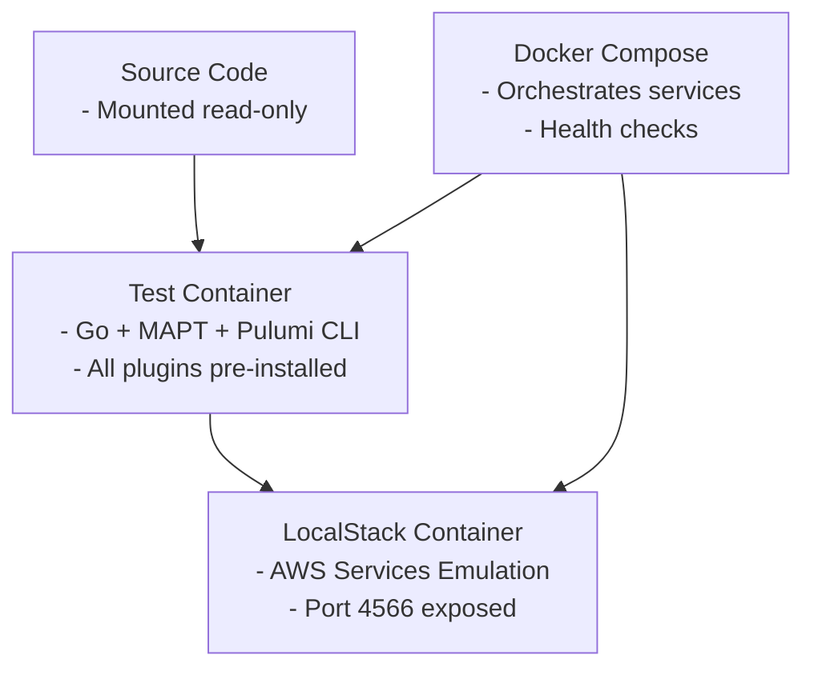

# Integration Tests

This directory contains integration tests for the MAPT project that use LocalStack to simulate AWS services locally.

## Overview

The integration tests are designed to validate the project's infrastructure-as-code functionality without requiring actual AWS resources. They support two execution modes:

- **🐳 Containerized Testing** (Recommended): Uses Docker Compose with pre-built containers
- **🖥️ Host-based Testing**: Runs tests directly on the host with auto-installed dependencies

Both approaches use:
- **LocalStack**: A local AWS cloud stack that emulates AWS services
- **Pulumi Go SDK**: Direct integration with Pulumi's Automation API for programmatic infrastructure management
- **Ginkgo**: BDD testing framework for Go

## 🐳 Containerized Testing (Recommended)

### Why Containerized?
✅ **Consistent Environment**: Same tools and versions every time  
✅ **No Host Dependencies**: Only Docker required  
✅ **CI/CD Ready**: Perfect for automated environments  
✅ **Faster Setup**: No tool installation needed  
✅ **Isolated**: Clean environment for each test run  

### Prerequisites
- **Docker**: Required to run containers
- **Docker Compose**: For orchestrating test environment

### Quick Start

```bash
# Run all integration tests in containers
make test-integration-container

# Run only AWS integration tests in containers  
make test-aws-container

# Run unit tests in containers (no LocalStack)
make test-unit-container

# Clean up test containers and images
make test-container-cleanup
```

### Advanced Usage

```bash
# Build test container manually
make test-integration-container-build

# Run specific test packages
docker-compose -f docker-compose.test.yml run --rm mapt-test-single \
  go test -v ./tests/integration/framework/

# Run with custom test arguments
docker-compose -f docker-compose.test.yml run --rm mapt-test-single \
  go test -v -timeout=15m -run="TestSpecific" ./tests/integration/aws/
```

### Container Architecture



## 🖥️ Host-based Testing

### Prerequisites
- **Docker**: Required to run LocalStack
- **curl**: Required for LocalStack health checks and Pulumi CLI installation
- **Go**: For running the test framework

**Note**: The Pulumi CLI will be automatically installed during test execution if not already available.

### Running Tests

```bash
# Run all integration tests on host
make test-integration

# Run with verbose output
make test-integration-verbose

# Run specific test packages
go test -v -timeout=10m ./tests/integration/aws/
```

### Verification Commands

```bash
# Check if dependencies are available
docker --version
curl --version
go version

# Pulumi CLI will be installed automatically if needed
```

## Test Structure

### Test Helpers

- `helpers/localstack.go`: Host-based LocalStack container lifecycle management
  - Automatically starts and configures LocalStack container
  - Installs Pulumi CLI if not available
  - Sets environment variables for Pulumi Go SDK
  - Handles cleanup after tests complete

- `helpers/localstack_container.go`: Containerized LocalStack environment helper
  - Lightweight configuration for pre-configured environments
  - Assumes LocalStack and tools are already available
  - Used when `MAPT_TEST_CONTAINER=true`

### Test Suites

- `aws/aws_basic_test.go`: Tests AWS-specific functionality with parameter validation
- `framework/framework_test.go`: Tests the integration testing framework itself

### Smart Environment Detection

Tests automatically detect their execution environment:

```go
if helpers.IsContainerizedEnvironment() {
    // Use ContainerLocalStackManager - lightweight setup
} else {
    // Use LocalStackManager - full container + tool management
}
```

## How It Works

### 🐳 Containerized Flow
1. **Docker Compose** starts LocalStack container with health checks
2. **Test container** built with MAPT + Pulumi CLI + Go + all plugins
3. **Source code** mounted into test container (read-only)
4. **Tests execute** with pre-configured LocalStack endpoints
5. **Environment variables** set automatically by Docker Compose
6. **Cleanup** handled automatically by Docker Compose

### 🖥️ Host-based Flow  
1. **LocalStackManager** starts LocalStack Docker container
2. **Pulumi CLI** auto-installed if not available (downloads from GitHub)
3. **Environment variables** configured for LocalStack endpoints
4. **Tests execute** using installed tools
5. **Cleanup** removes containers and restores environment

## Configuration

### LocalStack Services
The following AWS services are emulated:
- **EC2**: Virtual machines and networking
- **IAM**: Identity and access management  
- **S3**: Object storage
- **STS**: Security token service
- **CloudFormation**: Infrastructure stacks
- **CloudWatch Logs**: Log management

### Environment Variables

#### Automatic Configuration (Both Modes)
```bash
AWS_ENDPOINT_URL=http://localhost:4566    # (host) or http://localstack:4566 (container)
AWS_ACCESS_KEY_ID=test
AWS_SECRET_ACCESS_KEY=test
AWS_DEFAULT_REGION=us-east-1
USE_LOCALSTACK=true
PULUMI_CONFIG_PASSPHRASE=test
```

#### Container-specific
```bash
MAPT_TEST_CONTAINER=true  # Enables containerized mode detection
```

## Troubleshooting

### Containerized Tests

```bash
# Check container logs
docker-compose -f docker-compose.test.yml logs

# Access test container shell for debugging
docker-compose -f docker-compose.test.yml run --rm mapt-test-single bash

# Verify LocalStack health
docker-compose -f docker-compose.test.yml exec localstack curl http://localhost:4566/_localstack/health
```

### Host-based Tests

```bash
# Check LocalStack container status
docker ps | grep localstack

# Check LocalStack health
curl http://localhost:4566/_localstack/health

# Verify Pulumi installation
pulumi version

# Check AWS SDK configuration
aws sts get-caller-identity --endpoint-url http://localhost:4566
```

## CI/CD Integration

### GitHub Actions Example

```yaml
name: Integration Tests
on: [push, pull_request]
jobs:
  test:
    runs-on: ubuntu-latest
    steps:
      - uses: actions/checkout@v4
      - name: Run Integration Tests
        run: make test-integration-container
```

### Benefits in CI
- ✅ **No tool installation** required on CI runners
- ✅ **Faster execution** (no download steps)  
- ✅ **Consistent results** across different CI providers
- ✅ **Easy caching** of Docker images
- ✅ **Parallel execution** support

## Best Practices

1. **Use containerized tests** for CI/CD and team consistency
2. **Use host-based tests** for local development and debugging  
3. **Run cleanup commands** after test failures to avoid conflicts
4. **Monitor test execution time** and adjust timeouts as needed
5. **Check LocalStack health** if tests fail unexpectedly 